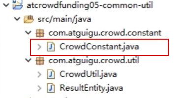
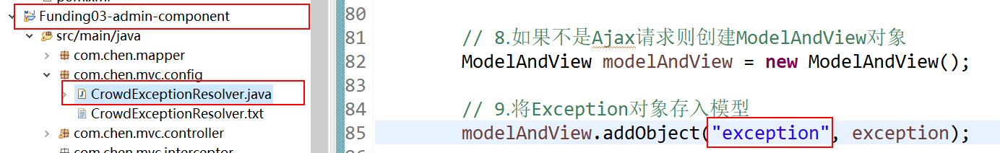
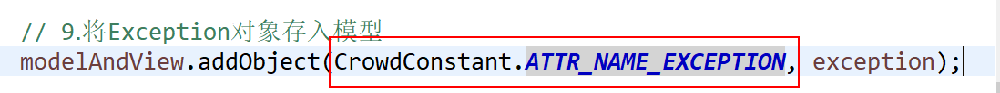

## 1. 创建常量类

声明一个类管理常量，可以防止打字打错，因为引用的话打错字就会有提示。

​	**1.1 在如下位置创建类**



```java
package com.atguigu.crowd.constant;

public class CrowdConstant {
	
	public static final String MESSAGE_LOGIN_FAILED = "抱歉！账号密码错误！请重新输入！";
	public static final String MESSAGE_LOGIN_ACCT_ALREADY_IN_USE = "抱歉！这个账号已经被使用了！";
	public static final String MESSAGE_ACCESS_FORBIDEN = "请登录以后再访问！";
	public static final String MESSAGE_STRING_INVALIDATE = "字符串不合法！请不要传入空字符串！";
	public static final String MESSAGE_SYSTEM_ERROR_LOGIN_NOT_UNIQUE = "系统错误：登录账号不唯一！";
	
	public static final String ATTR_NAME_EXCEPTION = "exception";
	public static final String ATTR_NAME_LOGIN_ADMIN = "loginAdmin";
	public static final String ATTR_NAME_PAGE_INFO = "pageInfo";

}
```

​	**1.2 应用例子**

原本是这样的：



修改成引用常量之后：




## 2. 后台前端页面

​	**2.1把所有静态资源复制到 webapp 目录下**

	### 2.2 创建后台首页

​	2.2.1 在WEB-INF 下创建 admin-login.jsp

​		页面完整代码（复制即可，有需要自己改改）

```jsp
<%@ page language="java" contentType="text/html; charset=UTF-8"
	pageEncoding="UTF-8"%>
<!DOCTYPE html>
<html lang="zh-CN">
<head>
<meta charset="UTF-8">
<meta http-equiv="X-UA-Compatible" content="IE=edge">
<meta name="viewport" content="width=device-width, initial-scale=1">
<meta name="description" content="">
<meta name="keys" content="">
<meta name="author" content="">
<base
	href="http://${pageContext.request.serverName }:${pageContext.request.serverPort }${pageContext.request.contextPath }/" />
<link rel="stylesheet" href="bootstrap/css/bootstrap.min.css">
<link rel="stylesheet" href="css/font-awesome.min.css">
<link rel="stylesheet" href="css/login.css">
<script src="jquery/jquery-2.1.1.min.js"></script>
<script src="bootstrap/js/bootstrap.min.js"></script>
<style>
</style>
<title>尚筹网</title>
</head>
<body>
	<nav class="navbar navbar-inverse navbar-fixed-top" role="navigation">
		<div class="container">
			<div class="navbar-header">
				<div>
					<a class="navbar-brand" href="index.html" style="font-size: 32px;">尚筹网-创意产品众筹平台</a>
				</div>
			</div>
		</div>
	</nav>

	<div class="container">

		<form action="admin/do/login.html" method="post" class="form-signin" role="form">
			<h2 class="form-signin-heading">
				<i class="glyphicon glyphicon-log-in"></i> 管理员登录
			</h2>
			<p>${requestScope.exception.message }</p>
			<div class="form-group has-success has-feedback">
				<input type="text" name="loginAcct" class="form-control" id="inputSuccess4"
					placeholder="请输入登录账号" autofocus> <span
					class="glyphicon glyphicon-user form-control-feedback"></span>
			</div>
			<div class="form-group has-success has-feedback">
				<input type="text" name="userPswd" class="form-control" id="inputSuccess4"
					placeholder="请输入登录密码" style="margin-top: 10px;"> <span
					class="glyphicon glyphicon-lock form-control-feedback"></span>
			</div>
			<button type="submit" class="btn btn-lg btn-success btn-block">登录</button>
		</form>
	</div>
</body>
</html>
```

​	2.2.2 在spring-mvc.xml 下增加配置

```xml
<!-- 配置view-controller，直接把请求地址和视图名称关联起来，不必写handler方法了 -->
	<!-- 
		@RequestMapping("/admin/to/login/page.html")
		public String toLoginPage(){
			return "admin-login";
		}
	 -->
	<mvc:view-controller path="/admin/to/login/page.html" view-name="admin-login"/>
```


**注意**

这个配置的位置不要乱放啊，长点心吧，比如这次放在异常映射的bean 里面，导致报错

```
Configuration problem: Cannot locate BeanDefinitionDecorator for element [view-controller]
```

把配置移出到bean外面解决


## 3. 使用layer弹层组件

​	**3.1把layer文件夹复制到webapp下**

​	**3.2 在index.jsp 里面引入**layer.js

​		引入要放在jQuery引入的后面

​	**3.3 使用layer弹层提示框**

```jsp
......

$("#btn3").click(function(){
			layer.msg("这是一个layer的弹框");
		});
	});
</script>
</head>
<body>
......
<button id="btn3">layer的提示框</button>
</body>
```


## 4. 修改错误提示页面

```jsp
<%@ page language="java" contentType="text/html; charset=UTF-8"
	pageEncoding="UTF-8"%>
<!DOCTYPE html>
<html lang="zh-CN">
<head>
<meta charset="UTF-8">
<meta http-equiv="X-UA-Compatible" content="IE=edge">
<meta name="viewport" content="width=device-width, initial-scale=1">
<meta name="description" content="">
<meta name="keys" content="">
<meta name="author" content="">
<base
	href="http://${pageContext.request.serverName }:${pageContext.request.serverPort }${pageContext.request.contextPath }/" />
<link rel="stylesheet" href="bootstrap/css/bootstrap.min.css">
<link rel="stylesheet" href="css/font-awesome.min.css">
<link rel="stylesheet" href="css/login.css">
<script type="text/javascript" src="jquery/jquery-2.1.1.min.js"></script>
<script type="text/javascript" src="bootstrap/js/bootstrap.min.js"></script>
<script type="text/javascript">
	$(function(){
		$("button").click(function(){
			// 相当于浏览器的后退按钮
			window.history.back();
		});
	});
</script>
<style>
</style>
</head>
<body>
	<nav class="navbar navbar-inverse navbar-fixed-top" role="navigation">
		<div class="container">
			<div class="navbar-header">
				<div>
					<a class="navbar-brand" href="index.html" style="font-size: 32px;">尚筹网-创意产品众筹平台</a>
				</div>
			</div>
		</div>
	</nav>

	<div class="container">
	
		<h2 class="form-signin-heading" style="text-align: center;">
			<i class="glyphicon glyphicon-log-in"></i> 尚筹网系统消息
		</h2>
		<!-- 
			requestScope对应的是存放request域数据的Map
			requestScope.exception相当于request.getAttribute("exception")
			requestScope.exception.message相当于exception.getMessage()
		 -->
		<h3 style="text-align: center;">${requestScope.exception.message }</h3>
		<button style="width: 150px;margin: 50px auto 0px auto;" class="btn btn-lg btn-success btn-block">点我返回上一步</button>
	</div>
</body>
</html>
```

**好了，从这里开始返回去看开发文档的第一页**

