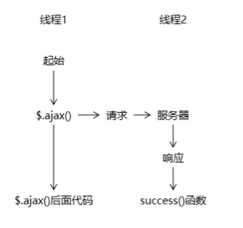
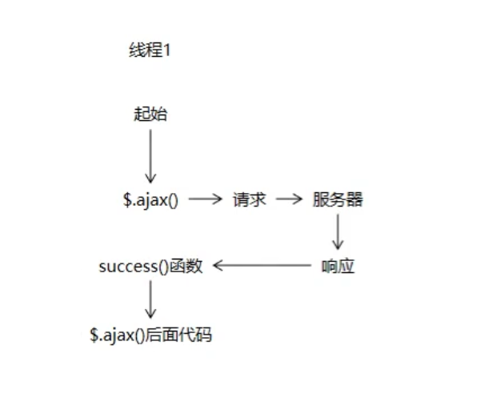
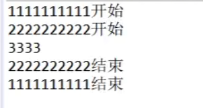

## 1. 分页

### 1.1 分页前端部分修改

后端部分在day02后面已经完成，

以下是前端部分修改的步骤：

### 1.1.1 调整 admin-page.jsp 的代码

​	**调整1**

​	**原代码**

```jsp
<ul class="pagination">
    <li class="disabled"><a href="#">上一页</a></li>
	<li class="active"><a href="#">1 <span class="sr-only">(current)</span></a></li>
	<li><a href="#">2</a></li>
	<li><a href="#">3</a></li>
	<li><a href="#">4</a></li>
	<li><a href="#">5</a></li>
	<li><a href="#">下一页</a></li>
</ul>
```

​	**替换为现代码**

```jsp
<div id="Pagination" class="pagination"><!-- 这里显示分页 --></div>
```

​	

​	**调整2**

​	**在jsp 页面引入pagination的css和js文件**

```jsp
<link rel="stylesheet" href="css/pagination.css">
<script type="text/javascript" src="jquery/jquery.pagination.js"></script>
```


​	**调整3 在admin-page.jsp 里面编写js**

```jsp
<script type="text/javascript">
	
	$(function(){
		
		// 调用后面声明的函数对页码导航条进行初始化操作
		initPagination();
		
	});
	
	// 生成页码导航条的函数
	function initPagination() {
		
		// 获取总记录数
		var totalRecord = ${requestScope.pageInfo.total};
		
		// 声明一个JSON对象存储Pagination要设置的属性
		var properties = {
			num_edge_entries: 3,								// 边缘页数
			num_display_entries: 5,								// 主体页数
			callback: pageSelectCallback,						
            // 指定用户点击“翻页”的按钮时跳转页面的回调函数
			items_per_page: ${requestScope.pageInfo.pageSize},	// 每页要显示的数据的数量
			current_page: ${requestScope.pageInfo.pageNum - 1},	
           // Pagination内部使用pageIndex来管理页码，pageIndex从0开始，pageNum从1开始，所以要减一
			prev_text: "上一页",									// 上一页按钮上显示的文本
			next_text: "下一页"									// 下一页按钮上显示的文本
		};
		
		// 生成页码导航条
		$("#Pagination").pagination(totalRecord, properties);
		
	}
	
	// 回调函数的含义：声明出来以后不是自己调用，而是交给系统或框架调用
	// 用户点击“上一页、下一页、1、2、3……”这样的页码时调用这个函数实现页面跳转
	// pageIndex是Pagination传给我们的那个“从0开始”的页码
	function pageSelectCallback(pageIndex, jQuery) {
		
		// 根据pageIndex计算得到pageNum
		var pageNum = pageIndex + 1;
		
		// 跳转页面
		window.location.href =
        "admin/get/page.html?pageNum="+pageNum+"&keyword=${param.keyword}";
		
		// 由于每一个页码按钮都是超链接，所以在这个函数最后取消超链接的默认行为
		return false;
	}
</script>
```


## 2. 删除

	### 2.1 调整admin-page.jsp的代码

​	旧代码：

```jsp
<button type="button" class="btn btn-danger btn-xs">
	<i class=" glyphicon glyphicon-remove"></i>
</button>
```

​	新代码：

```jsp
<a href="admin/remove/${admin.id}/${requestScope.pageInfo.pageNum}/${param.keyword}.html" class="btn btn-danger btn-xs">
	<i class=" glyphicon glyphicon-remove"></i>
</a>
```

### 2.2 编写AdminController

service和实现自己写

```java
//管理员-删除
	@RequestMapping("admin/remove/{adminId}/{pageNum}/{keyword}.html")
	public String adminRemove(
			@PathVariable("adminId")Integer id,
			@PathVariable("pageNum")String pageNum,
			@PathVariable("keyword")String keyword,
			HttpSession session) {
		//不能把当前登录的用户删了，就是不能自己删除自己
		Admin admin =(Admin)session.getAttribute(CrowdConstant.ATTR_NAME_LOGIN_ADMIN);
		Integer aid=admin.getId();
		logger.info("===当前用户的id是："+aid+" ===");
		if(id.equals(aid)) {
			throw new RuntimeException("不能删除当前登录用户");
		}
		ads.removeAdminById(id);
		return "redirect:/admin/get/page.html?pageNum="+pageNum+"&keyword="+keyword;
	}
```

好了，回去看笔记吧


## 3. 异步的工作方式

### 3.1 图解



### 3.2 代码

```jsp
<script type="text/javascript">
	$(function(){
		$("#asyncBtn").click(function(){
			
			console.log("ajax函数之前");
			
			$.ajax({
				"url":"test/ajax/async.html",
				"type":"post",
				"dataType":"text",
                
				"async": false,		
                // 关闭异步工作模型，使用同步方式工作。此时：所有操作在同一个线程内按顺序完成
                
				"success":function(response){
					
					// success是接收到服务器端响应后执行
					console.log("ajax函数内部的success函数"+response);
				}
			});
			
			// 在$.ajax()执行完成后执行，不等待success()函数
			console.log("ajax函数之后");
			/* setTimeout(function(){
				
			}, 5000); */
			
		});
	});
</script>
```

### 3.3 打印的效果


## 4. 同步的工作方式

### 4.1 图解



### 4.2 代码

```java
@Test
	public void testSync() {
		method01();
	}
	
	public void method01() {
		System.out.println("1111111111开始");
		method02();
		System.out.println("1111111111结束");
	}
	
	public void method02() {
		System.out.println("2222222222开始");
		method03();
		System.out.println("2222222222结束");
	}
	
	public void method03() {
		System.out.println("3333");
	}
```

### 4.3 打印效果

