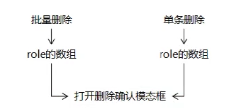

## 角色删除

### 1.后端代码

​	**1.1 Controller**

```java
//角色-删除
	@ResponseBody
	@RequestMapping("role/remove/by/role/id/array.json")
	public ResultEntity<String> removeRole(@RequestBody List<Integer> roleIdList){
		rs.removeRole(roleIdList);
		return ResultEntity.successWithoutData();
	}
```

​	**1.2 Service**

```java
@Override
	public void removeRole(List<Integer> roleIdArray) {
		RoleExample re = new RoleExample();
		re.createCriteria().andIdIn(roleIdArray);
		rm.deleteByExample(re);
		
	}
```

### 2.前端代码

​	**2.1**声明函数用于打开动态模态框



​	**2.1.1 写到 my-role.js 文件里面**

```js
// 声明专门的函数显示确认模态框
function showConfirmModal(roleArray){
	//打开模态框
	$("#confirmModal").modal("show");
	//清楚旧数据
	$("#removeDiv").empty();
	//创建全局变量-数组存放id
	window.roleIdArray=[];
	//遍历数组，获取名字，添加到confirmModal里去显示
	for(var i=0;i<roleArray.length;i++){
		var role=roleArray[i];
		var roleName=role.roleName;
		$("#removeDiv").append(roleName+"</br>");
		var roleId=role.roleId;
		/*alert(roleId);*/
		// 调用数组对象的push()方法存入新元素
		window.roleIdArray.push(roleId);
	}
```

​	**2.1.2 role-page.jsp**

```jsp
<javascript>
//8.执行单条删除-就是铅笔按钮图标后面的那个删除按钮
		$("#rolePageBody").on("click",".removeBtn",function(){
			var roleName=$(this).parent().prev().text();
			//获取roleArray
			var roleArray=[{
					roleId:this.id,
					roleName:roleName
			}];
			
			showConfirmModal(roleArray);
			
		});
		
		//9.删除-点击模态框确认删除按钮时
		$("#removeRoleBtn").click(function(){
			//把从全局变量获取的roleIdArray数组转换成json字符
			var requestBody = JSON.stringify(window.roleIdArray);
			/* alert(requestBody); */
			$.ajax({
				"url":"role/remove/by/role/id/array.json",
				"type":"post",
				"data":requestBody,
				
				"contentType":"application/json;charset=UTF-8",
					
				"dataType":"json",
				"success":function(response){
					if(response.result=="SUCCESS"){
						generatePage();
						layer.msg("成功删除");
					}else{
						layer.msg(response.message);
					}
				},
				"error":function(response){
					layer.msg("删除失败"+response.status+"   "+response.statusTexth);
				}
			});
			//关闭模态框
			$("#confirmModal").modal("hide");
		});
		
		//10.点击多选框，全选和不全选
		//10.1 点击全选，全选下面的全部按钮
		$("#summaryBox").click(function(){
			//获取全选框的选择状态
			var summaryBoxStatus=this.checked;
			//下面子选择框的状态跟着改
			$(".itemBox").prop("checked",summaryBoxStatus);
		});
		//10.2点击下面全部的子选择框，上面的全选框状态页改为全选
		/* 这两个方法都有一个bug，就是点击下一页之后，全选框还是勾选状态 */
		 $("#rolePageBody").on("click",".itemBox",function(){
			//获取现在有几个被选择了
			var itemBoxLength=$(".itemBox:checked").length;
			//获取总长度
			var totalLength=$(".itemBox").length;
			$("#summaryBox").prop("checked",itemBoxLength==totalLength);
		}); 
		//10.2 方式二
		/* $("#rolePageBody").on("click", ".itemBox", function() {
			var checked = true;
			var itemBoxArray = $(".itemBox");
			for (var i = 0; i < itemBoxArray.length; i++) {
				if (!itemBoxArray[i].checked) {// 只要有一个为false，那么总的checked就为false
					checked = false;
				}
			}
			$("#summaryBox").prop("checked", checked);
		}); */
		
		//11.多条删除
		$("#batchRemoveBtn").click(function(){
			//创建一个数组来存放后面获取到的角色对象
			var roleArray=[];
			//遍历
			$(".itemBox:checked").each(function(){
				roleId=this.id;
				roleName=$(this).parent().next().text();
				roleArray.push({
					"roleId":roleId,
					"roleName":roleName
				});
				
			});
			//检查长度是否为0
			if(roleArray.length==0){
				layer.msg("至少选一个再点我，少侠");
				return null;
			}
			showConfirmModal(roleArray);
		});
```

