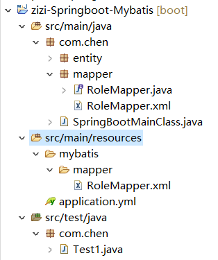
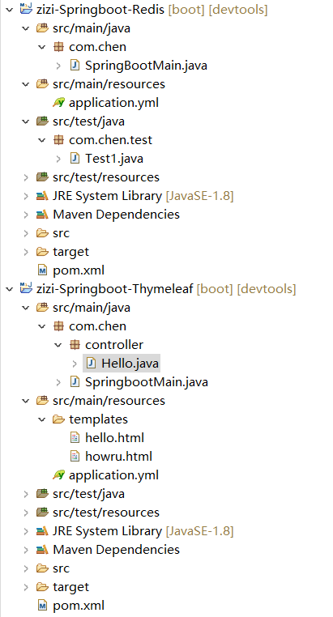

### 1. 扫描包

会被自动扫描的包

​	主启动类所在包，主启动类所在包的子包会被自动扫描

**手动设定扫描的包，但此时Spring Boot约定默认规则会失效**

​	在主启动类上添加注解：@ComponentScan(" 扫描的包路径")

### 2. 版本管理

​	Spring Boot对引入到开发环境的jar版本进行了严格的测试，我们在使用时关心所需要引入的jar包即可，不必关心版本号。不同jar包之间的版本匹配信息Spring Boot已经帮我们协调好了。比如SpringMVC在进行JSON数据转换时需要用到的Jackson，但是并没有明确依赖Jackson，这就导致我们使用SpringMVC时导入错误的Jackson版本从而无法实现JSON格式转换，现在有了Spring Boot对版本进行统一的管理就解决了这个问题。当然，Spring Boot没有管理的依赖，我们在引入时还是需要写清楚版本号的。

***重新开启学习-2020年10月28日***

***重新开启学习-2020年12月10日***

### 3. SpringBoot 整合Mybatis

#### 3.1 创建简单Maven工程，jar形式

加入依赖

```xml
<parent>
		<groupId>org.springframework.boot</groupId>
		<artifactId>spring-boot-starter-parent</artifactId>
		<version>2.1.6.RELEASE</version>
	</parent>

	<dependencies>
		<dependency>
			<groupId>org.mybatis.spring.boot</groupId>
			<artifactId>mybatis-spring-boot-starter</artifactId>
			<version>2.1.0</version>
		</dependency>
		<dependency>
			<groupId>mysql</groupId>
			<artifactId>mysql-connector-java</artifactId>
		</dependency>
		<dependency>
			<groupId>com.alibaba</groupId>
			<artifactId>druid</artifactId>
			<version>1.0.5</version>
		</dependency>
		<dependency>
			<groupId>org.springframework.boot</groupId>
			<artifactId>spring-boot-starter-test</artifactId>
			<scope>test</scope>
		</dependency>
	</dependencies>
```

#### 3.2 创建主启动类，并加入配置文件

```java
//扫描mapper包一定要有
@MapperScan("com.chen.mapper")
@SpringBootApplication
public class SpringBootMainClass {
	public static void main(String[] args) {
		SpringApplication.run(SpringBootMainClass.class, args);
	}
}
```

```yaml
spring:
  datasource:
    name: mydb
    type: com.alibaba.druid.pool.DruidDataSource
    url: jdbc:mysql://127.0.0.1:3306/project_crowd?serverTimezone=UTC
    username: root
    password: 1111
    driver-class-name: com.mysql.cj.jdbc.Driver
mybatis:
  mapper-locations: classpath*:/mybatis/mapper/*Mapper.xml
#logging:
#  level:
#    com.atguigu.spring.boot.mapper: debug
#    com.atguigu.spring.boot.test: debug
```

存放位置如下：



#### 3.3创建测试类

```java
package com.chen;

import java.util.List;

import org.junit.Test;
import org.junit.runner.RunWith;
import org.springframework.beans.factory.annotation.Autowired;
import org.springframework.boot.test.context.SpringBootTest;
import org.springframework.test.context.junit4.SpringRunner;

import com.chen.entity.Role;
import com.chen.entity.RoleExample;
import com.chen.mapper.RoleMapper;


@RunWith(SpringRunner.class)
@SpringBootTest
public class Test1 {
	@Autowired
	RoleMapper rm;

	/** 测试数据库连不连得上 */
	@Test
	public void testc() {
		RoleExample example = new RoleExample();
		List<Role> list = rm.selectByExample(example);
		for(Role r: list) {
			System.out.println("==="+r.getName()+"===");
		}
	}
}
```


**2020年12月14日**

### 4. SpringBoot 整合Redis

#### 4.1 加入依赖

```xml
<parent>
		<groupId>org.springframework.boot</groupId>
		<artifactId>spring-boot-starter-parent</artifactId>
		<version>2.1.6.RELEASE</version>
	</parent>
	
	<dependencies>
		<dependency>
			<groupId>com.alibaba</groupId>
			<artifactId>druid</artifactId>
			<version>1.0.5</version>
		</dependency>
		<dependency>
			<groupId>org.springframework.boot</groupId>
			<artifactId>spring-boot-starter-test</artifactId>
			<scope>test</scope>
		</dependency>
		
		<dependency>
            <groupId>org.springframework.boot</groupId>
            <artifactId>spring-boot-starter-data-redis</artifactId>
        </dependency>
        <dependency>
            <groupId>org.springframework.boot</groupId>
            <artifactId>spring-boot-starter-web</artifactId>
        </dependency>
        <dependency>
            <groupId>org.springframework.boot</groupId>
            <artifactId>spring-boot-devtools</artifactId>
            <scope>runtime</scope>
            <optional>true</optional>
        </dependency>
        <dependency>
            <groupId>org.springframework.boot</groupId>
            <artifactId>spring-boot-configuration-processor</artifactId>
            <optional>true</optional>
        </dependency>
        <dependency>
            <groupId>org.springframework.boot</groupId>
            <artifactId>spring-boot-starter-test</artifactId>
            <scope>test</scope>
        </dependency>
	</dependencies>
	
	<properties>
        <java.version>1.8</java.version>
    </properties>


    <build>
        <plugins>
            <plugin>
                <groupId>org.springframework.boot</groupId>
                <artifactId>spring-boot-maven-plugin</artifactId>
            </plugin>
        </plugins>
    </build>
```

#### 4.2 创建主启动类、配置文件

```java
@SpringBootApplication
public class SpringBootMain {
	public static void main(String[] args) {
		SpringApplication.run(SpringBootMain.class, args);
	}
}
```

```yaml
spring:
  redis:
    host: 127.0.0.1
    port: 6379
```

#### 4.3 测试

```java
@RunWith(SpringRunner.class)
@SpringBootTest
public class Test1 {
	@Autowired
	RedisTemplate<String, String> rt;
	
	@Test
	public void testx() {
		System.out.println(rt.opsForSet().add("美食", "关东煮"));
		System.out.println(rt.opsForSet().add("美食", "蟹肉棒"));
		System.out.println(rt.opsForSet().members("美食"));
	}
}
```


### 5. SpringBoot 整合Thymeleaf

#### 5.1 加入依赖

和上一个一样，再加入thymeleaf的依赖

```xml
<dependency>
	<groupId>org.springframework.boot</groupId>
	<artifactId>spring-boot-starter-thymeleaf</artifactId>
</dependency>
```

#### 5.2 配置文件

```yaml
spring:
  thymeleaf:
    prefix: classpath:/templates/
    suffix: .html
    cache: false
    encoding: UTF-8
```

#### 5.3 测试

创建测试的html

```html
<h1 th:text="这是服务器打开的文件显示的内容，嘻嘻。">这是直接打开文件显示的内容</h1>
```

创建Controller

```java
@Controller
public class Hello {
	@RequestMapping("/test/thymeleaf")
	public String HelloTest() {
		return "hello";
	}
}
```

文件位置如图：



