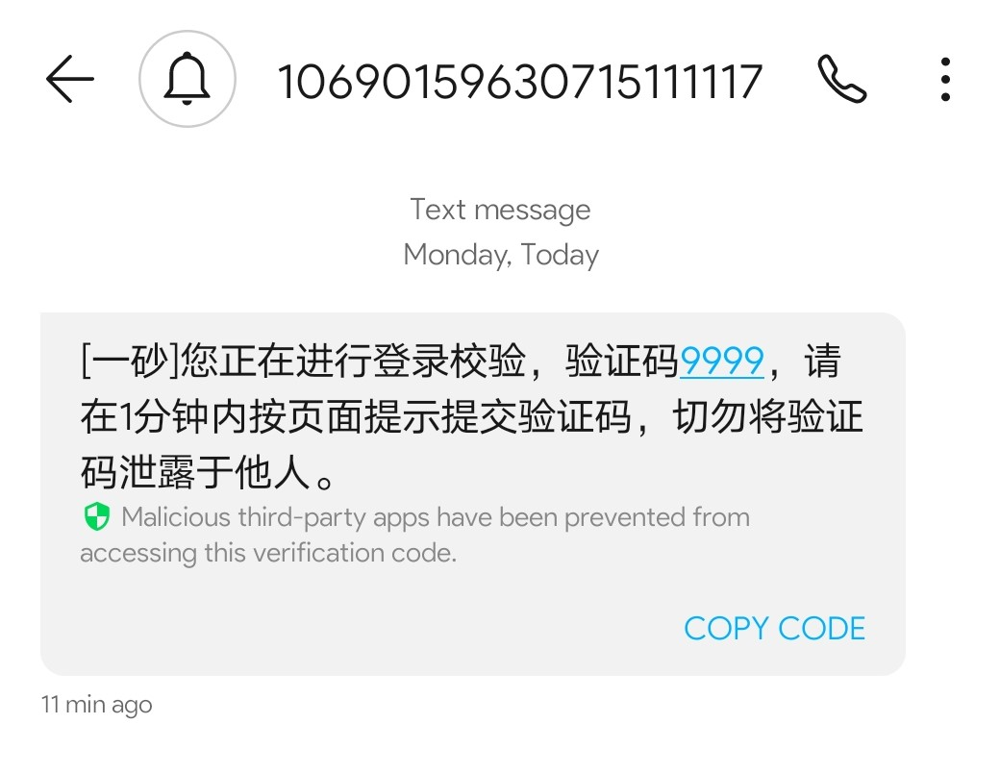
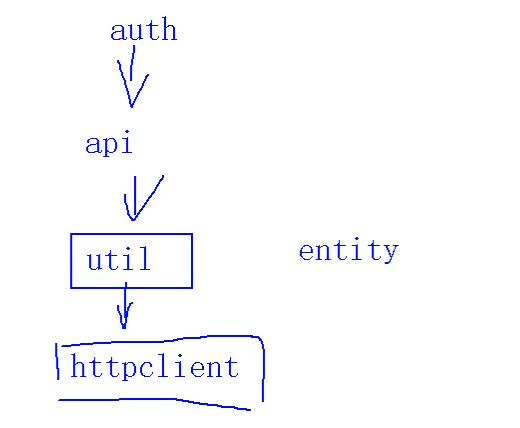
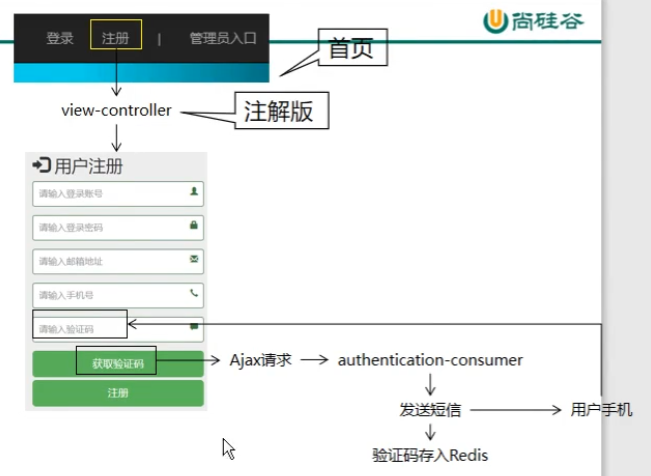
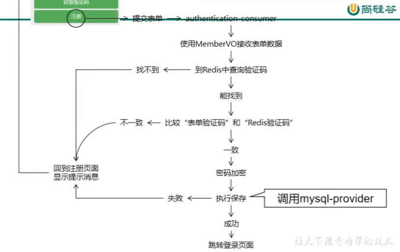

#  会员注册

## 1. 在工程12里面测试一下

### 1.1新建短信API测试类

**1.1.1到阿里云API市场-购买短信接口服务包 **

[这是我购买的]:https://market.aliyun.com/products/57126001/cmapi00040066.html?spm=5176.2020520132.101.3.61bf7218urP4el

**1.1.2复制接口页面的请求示例，改成自己需要的**

```java
package com.chen.test;

import java.util.HashMap;
import java.util.Map;

import org.apache.http.HttpResponse;
import org.junit.Test;
import org.junit.runner.RunWith;
import org.springframework.boot.test.context.SpringBootTest;
import org.springframework.test.context.junit4.SpringRunner;

import com.aliyun.api.gateway.demo.util.HttpUtils;

/** 

* @author Jasper

* @version 创建时间：2020年12月28日 上午10:55:58 

* 类说明

*/
@RunWith(SpringRunner.class)
@SpringBootTest
public class messageTest {
	
	@Test
	public void messageTest1() {
		 String host = "https://intlsms.market.alicloudapi.com";
		    String path = "/comms/sms/sendmsgall";
		    String method = "POST";
		    String appcode = "aad14596b0814f028a940470c30528d8";
		    Map<String, String> headers = new HashMap<String, String>();
		    //最后在header中的格式(中间是英文空格)为Authorization:APPCODE 83359fd73fe94948385f570e3c139105
		    headers.put("Authorization", "APPCODE " + appcode);
		    //根据API的要求，定义相对应的Content-Type
		    headers.put("Content-Type", "application/x-www-form-urlencoded; charset=UTF-8");
		    Map<String, String> querys = new HashMap<String, String>();
		    Map<String, String> bodys = new HashMap<String, String>();
		    //可选	短信下发状态回调通知地址（主动回调）
		    bodys.put("callbackUrl", "http://test.dev.esandcloud.com");
		    //可选	0: 默认通道（默认值） 1: 高质量通道
		    bodys.put("channel", "0");
		    //必选	手机号码，采用 e.164 标准，格式为+[国家或地区码][手机号]，例如：+8613700000000
		    bodys.put("mobile", "+8613226142598");
		    //必选	模板 ID, 登录https://openali.esandcloud.com申请
		    bodys.put("templateID", "0000000");
		    //可选	模板参数(多个参数用逗号分隔)。
		    bodys.put("templateParamSet", "2233, 1");


		    try {
		    	/**
		    	* 重要提示如下:
		    	* HttpUtils请从
		    	* https://github.com/aliyun/api-gateway-demo-sign-java/blob/master/src/main/java/com/aliyun/api/gateway/demo/util/HttpUtils.java
		    	* 下载
		    	*
		    	* 相应的依赖请参照
		    	* https://github.com/aliyun/api-gateway-demo-sign-java/blob/master/pom.xml
		    	*/
		    	HttpResponse response = HttpUtils.doPost(host, path, method, headers, querys, bodys);
		    	System.out.println(response.toString());
		    	//获取response的body
		    	//System.out.println(EntityUtils.toString(response.getEntity()));
		    } catch (Exception e) {
		    	e.printStackTrace();
		    }
	}
}

```

其中的HttpUtils和依赖直接访问示例里所给的网址，复制，稍微修改一下依赖，之后导入即可

```xml
<!-- 以下是验证码短信发送所需依赖 -->
		<dependency>
			<groupId>com.alibaba</groupId>
			<artifactId>fastjson</artifactId>
			<version>1.2.15</version>
		</dependency>
        <dependency>
            <groupId>org.apache.httpcomponents</groupId>
            <artifactId>httpclient</artifactId>
            <!-- <version>4.2.1</version> -->
        </dependency>
        <dependency>
            <groupId>org.apache.httpcomponents</groupId>
            <artifactId>httpcore</artifactId>
            <!-- <version>4.2.1</version> -->
        </dependency>
        <dependency>
            <groupId>commons-lang</groupId>
            <artifactId>commons-lang</artifactId>
            <version>2.6</version>
        </dependency>
        <dependency>
            <groupId>org.eclipse.jetty</groupId>
            <artifactId>jetty-util</artifactId>
           <!--  <version>9.3.7.v20160115</version> -->
        </dependency>
        <!-- <dependency>
            <groupId>junit</groupId>
            <artifactId>junit</artifactId>
            <version>4.5</version>
            <scope>test</scope>
        </dependency> -->
```

**1.1.3 手机成功收到验证码如图**




### 1.2 正式把API导入项目工具包里

**1.2.1 把依赖转到05工程里面**



```xml
<!-- 以下是验证码短信发送所需依赖 -->
		<dependency>
			<groupId>com.alibaba</groupId>
			<artifactId>fastjson</artifactId>
			<version>1.2.15</version>
		</dependency>
        <dependency>
            <groupId>org.apache.httpcomponents</groupId>
            <artifactId>httpclient</artifactId>
            <version>4.2.1</version> 
        </dependency>
        <dependency>
            <groupId>org.apache.httpcomponents</groupId>
            <artifactId>httpcore</artifactId>
            <version>4.2.1</version> 
        </dependency>
        <dependency>
            <groupId>commons-lang</groupId>
            <artifactId>commons-lang</artifactId>
            <version>2.6</version>
        </dependency> 
        <dependency>
            <groupId>org.eclipse.jetty</groupId>
            <artifactId>jetty-util</artifactId>
            <version>9.3.7.v20160115</version>
        </dependency>
```

**1.2.2 把HttpUtils也转移到05工程里**

**1.2.3 在工具类 CrowdUti里编写短信发送方法**

```java
/** 给远程第三方短信接口发送请求把验证码发送到用户手机上
	 * 0000:成功		i005:业务异常		9999:系统异常		1999:服务异常
	 * 成功：返回验证码
	 * 失败：返回失败消息
	 *  */
	public static ResultEntity<String> sendCodeByMessage(
			String mobile,
			//模板编号；测试用默认的：0000000
			String templateID
			){
		String host = "https://intlsms.market.alicloudapi.com";
	    String path = "/comms/sms/sendmsgall";
	    String method = "POST";
	    String appcode = "aad14596b0814f028a940470c30528d8";
	    Map<String, String> headers = new HashMap<String, String>();
	    //最后在header中的格式(中间是英文空格)为Authorization:APPCODE 83359fd73fe94948385f570e3c139105
	    headers.put("Authorization", "APPCODE " + appcode);
	    //根据API的要求，定义相对应的Content-Type
	    headers.put("Content-Type", "application/x-www-form-urlencoded; charset=UTF-8");
	    Map<String, String> querys = new HashMap<String, String>();
	    Map<String, String> bodys = new HashMap<String, String>();
	    //可选	短信下发状态回调通知地址（主动回调）
	    bodys.put("callbackUrl", "http://test.dev.esandcloud.com");
	    //可选	0: 默认通道（默认值） 1: 高质量通道
	    bodys.put("channel", "0");
	    //必选	手机号码，采用 e.164 标准，格式为+[国家或地区码][手机号]，例如：+8613700000000
	    bodys.put("mobile", mobile);
	    //必选	模板 ID, 登录https://openali.esandcloud.com申请
	    bodys.put("templateID", templateID);
	    
	 	//生成4位数验证码
	    StringBuilder sbd = new StringBuilder();
	    for(int i=0;i<4;i++) {
	    int rd = (int)(Math.random()*10);
	    sbd.append(rd);
	    }
	    String code = sbd.toString();
	    sbd.append(", 1");
	    String s = sbd.toString();
	    //可选	模板参数(多个参数用逗号分隔)
	    bodys.put("templateParamSet", s);
	    
	    try {
	    	/**
	    	* 重要提示如下:
	    	* HttpUtils请从
	    	* https://github.com/aliyun/api-gateway-demo-sign-java/blob/master/src/main/java/com/aliyun/api/gateway/demo/util/HttpUtils.java
	    	* 下载
	    	*
	    	* 相应的依赖请参照
	    	* https://github.com/aliyun/api-gateway-demo-sign-java/blob/master/pom.xml
	    	*/
	    	HttpResponse response = HttpUtils.doPost(host, path, method, headers, querys, bodys);
	    	System.out.println(response.toString());
	    	//获取response的body
	    	//System.out.println(EntityUtils.toString(response.getEntity()));
	    	//0000:成功		i005:业务异常		9999:系统异常		1999:服务异常
	    	int statusCode = response.getStatusLine().getStatusCode();
	    	String reasonPhrase = response.getStatusLine().getReasonPhrase();
	    	if(statusCode==0000) {
	    		//成功，返回验证码
	    		return ResultEntity.successWithData(code);
	    	}
	    	//失败，返回原因
	    	return ResultEntity.failed(reasonPhrase);
	    } catch (Exception e) {
	    	e.printStackTrace();
	    	return ResultEntity.failed(e.getMessage());
	    }
	}
```


## 2. 发送验证码流程

### 2.1 思路



### 2.2 目标

	1. 将验证码发送到用户手机上
	2. 将验证码存入Redis

### 2.3  代码

**2.3.1工程12新建config包，里面新建类 CrowdWebMvcConfig实现接口WebMvcConfigurer，重写addViewController**

使其可以访问注册页

```java
@Configuration
public class CrowdWebMvcConfig implements WebMvcConfigurer{

	public void addViewControllers(ViewControllerRegistry registry) {
		// 浏览器访问的地址
		String urlPath = "/auth/member/to/reg/page";
		
		// 目标视图的名称，将来拼接“prefix: classpath:/templates/”、“suffix: .html”前后缀
		String viewName = "member-reg";
		
		//添加
		registry.addViewController(urlPath).setViewName(viewName);
		
	}
	
}
```

**2.3.2 修改注册超链接**

在protal.html里面搜索“注册”

```html
<a th:href="@{/auth/member/to/reg/page}">注册</a>
```

**2.3.3 准备注册页面member-reg.html**

修改html页面内容

```html
<html lang="zh-CN" xmlns="http://www.thymeleaf.org">
<meta charset="UTF-8">
<base th:href="@{/}"/>
```

把layer拿过来放static文件夹里，在html里引用

```html
<script src="layer/layer.js"></script>

<script type="text/javascript">
	layer.msg("aaa...")
</script>
```

设置获取验证码button按钮：

```html
<button type="button" id="sendCodeBtn" class="btn btn-lg btn-success btn-block"> 获取验证码</button>
```

编写页面发送验证码的Ajax

```html
<script type="text/javascript">
	$(function(){
		$("#sendCodeBtn").click(function(){
			
			// 1.获取接收短信的手机号
			var phoneNum = $.trim($("[name=phoneNum]").val());
			
			// 2.发送请求
			$.ajax({
				"url":"auth/member/send/short/message.json",
				"type":"post",
				"data":{
					"phoneNum":phoneNum
				},
				"dataType":"json",
				"success":function(response){
					
					var result = response.result;
					if(result == "SUCCESS") {
						layer.msg("发送成功！");
					}
					
					if(result == "FAILED") {
						layer.msg("发送失败！请再试一次！");
					}
				},
				"error":function(response){
					layer.msg(response.status + " " + response.statusText);
				}
			});
			
		});
	});
</script>
```

**2.3.4 工程12 新建 memberController**

在config包里新建shortMessageProperties.java配置类：

```java
package com.chen.config;

import org.springframework.boot.context.properties.ConfigurationProperties;
import org.springframework.stereotype.Component;

/** 

* @author Jasper

* @version 创建时间：2020年12月30日 上午9:16:13 

* 类说明

*/
@Component
@ConfigurationProperties(prefix = "short.msg")
public class ShortMessageProperties {
	private String appCode;
	private String tempID;
    
	public String getAppCode() {
		return appCode;
	}
	public void setAppCode(String appCode) {
		this.appCode = appCode;
	}
	public String getTempID() {
		return tempID;
	}
	public void setTempID(String tempID) {
		this.tempID = tempID;
	}
	@Override
	public String toString() {
		return "shortMessageProperties [appCode=" + appCode + ", tempID=" + tempID + "]";
	}
	public ShortMessageProperties(String appCode, String tempID) {
		super();
		this.appCode = appCode;
		this.tempID = tempID;
	}
	public ShortMessageProperties() {
		super();
		// TODO Auto-generated constructor stub
	}	
}
```

配置文件yml里新增配置：

```yaml
short: 
  msg: 
    appCode: aad14596b0814f028a940470c30528d8
    tempID: '20201228142809'
    #上面一行如果不加单引号的话，可能会被当成二进制转换成十进制
```

最后，在memberConroller里新建短信发送验证的controller

```java
package com.chen.controller;

import java.util.concurrent.TimeUnit;

import org.springframework.beans.factory.annotation.Autowired;
import org.springframework.stereotype.Controller;
import org.springframework.web.bind.annotation.RequestMapping;
import org.springframework.web.bind.annotation.RequestParam;
import org.springframework.web.bind.annotation.ResponseBody;

import com.chen.api.redisRemoteService;
import com.chen.config.ShortMessageProperties;
import com.chen.constant.CrowdConstant;
import com.chen.util.CrowdUtil;
import com.chen.util.ResultEntity;

/** 

* @author Jasper

* @version 创建时间：2020年12月30日 上午10:33:12 

* 类说明

*/
@Controller
public class MemberController {
	@Autowired
	ShortMessageProperties smp;
	@Autowired
	redisRemoteService rrs;
	
	@ResponseBody
	@RequestMapping("/auth/member/send/short/message.json")
	public ResultEntity<String> sendMessage(@RequestParam("phoneNum") String phoneNum) {
		//这个+86一定要加啊，傻子，不然收不到验证码
		StringBuilder stringBuilder = new StringBuilder();
		stringBuilder.append("+86");
		stringBuilder.append(phoneNum);
		String pn = stringBuilder.toString();
		// 1.发送验证码到phoneNum手机
		ResultEntity<String> sendMessageResultEntity = CrowdUtil.sendCodeByMessage(pn, smp.getAppCode(), smp.getTempID());
		
		// 2.判断短信发送结果
		if(ResultEntity.SUCCESS.equals(sendMessageResultEntity.getResult())) {
			// 3.如果发送成功，则将验证码存入Redis
			// ①从上一步操作的结果中获取随机生成的验证码
			String code = sendMessageResultEntity.getData();
			
			// ②拼接一个用于在Redis中存储数据的key
			String key = CrowdConstant.REDIS_CODE_PREFIX + pn;
			
			// ③调用远程接口存入Redis
			ResultEntity<String> saveCodeResultEntity = rrs.setRedisKeyValueRemoteWithTimeout(key, code, 15, TimeUnit.MINUTES);
			
			// ④判断结果
			if(ResultEntity.SUCCESS.equals(saveCodeResultEntity.getResult())) {
				
				return ResultEntity.successWithoutData();
			}else {
				return saveCodeResultEntity;
			}
		} else {
			return sendMessageResultEntity;
		}
	}
}
```

**记得在工程12的主启动类里启用Feign功能**

```java
@EnableFeignClients
@EnableDiscoveryClient
```


## 3. 执行注册流程

### 3.1 目标

如果针对注册操作所做的各项验证通过，则将member信息存入数据库。

### 3.2 思路



### 3.3 代码

#### 3.3.1 给表的 loginacct 增加唯一约束

索引→UNIQUE	

更改注册页面：

```html
<form action="/auth/do/member/register" method="post" class="form-signin" role="form">
    <!--这里一定要是post的方式，因为提交过去要封装成VO对象 -->
    
<p th:text="${message}">这里显示从请求域取出的提示消息</p>
    <!-- 上面这一行这个加在“用户注册”文字下面下面 -->
    
<div class="form-group has-success has-feedback">
	<input type="text" name="username" class="form-control" placeholder="请输入用户昵称" 
      style="margin-top:10px;"> <span class="glyphicon glyphicon-lock form-control-feedback"></span>
</div>
    <!--加上这个，不过记得每个输入框加上name属性，命名和VO类一致-->
    
<button type="submit" class="btn btn-lg btn-success btn-block">注册</button>
    <!--修改按钮type为submit-->
```


#### 3.3.2在工程09中新建实体类MemberVo

专门用于封装前端提交过来的表单数据

```java
package com.chen.vo;
/** 

* @author Jasper

* @version 创建时间：2020年12月31日 上午10:41:33 

* 类说明:浏览器提交的注册信息

*/
public class MemberRegVo {
	private String loginacct;
	private String userpswd;
	private String username;
	private String email;
	private String phoneNum;
	private String code;
	
	//get,set,构造，toString......
}
```


#### 3.3.3 在工程17-api暴露接口

在Fegin接口中声明新的方法

```java
@RequestMapping("save/member/remote")
ResultEntity<String> saveMemberRemote(@RequestBody MemberPo mpo);
//@RequestBody 一定要加，不然接收不到
```

#### 3.3.2 工程10-mysql里面

实现api暴露的接口

**Controller**

```java
package com.chen.controller;

import org.springframework.beans.factory.annotation.Autowired;
import org.springframework.dao.DuplicateKeyException;
import org.springframework.web.bind.annotation.RequestBody;
import org.springframework.web.bind.annotation.RequestMapping;
import org.springframework.web.bind.annotation.RequestParam;
import org.springframework.web.bind.annotation.RestController;

import com.chen.constant.CrowdConstant;
import com.chen.po.MemberPo;
import com.chen.service.api.mySqlMemberServiceApi;
import com.chen.util.ResultEntity;

/** 

* @author Jasper

* @version 创建时间：2020年12月24日 下午4:46:35 

* 类说明

*/
@RestController
public class memberProviderController {
	@Autowired
	private mySqlMemberServiceApi mmsa;
	
	@RequestMapping("save/member/remote")
	ResultEntity<String> saveMemberRemote(
        	//这个@RequestBody一定要加，不然接收不到数据
			@RequestBody MemberPo mpo){
		try {
			System.out.println("controller收到的PO"+mpo.toString()+"===");
			mmsa.saveMemberService(mpo);
			return ResultEntity.successWithoutData();
		} catch (Exception e) {
			e.printStackTrace();
			//账号重复类型的错误
			if(e instanceof DuplicateKeyException) {
				return ResultEntity.failed(CrowdConstant.MESSAGE_LOGIN_ACCT_ALREADY_IN_USE);
			}
			return ResultEntity.failed(e.getMessage());
		}
	}
	
	@RequestMapping("/get/member/by/login/remote")
	ResultEntity<MemberPo> getMemberByLoginRemote(@RequestParam("loginacct")String loginacct){
		try {
			//如果查得到--正常
			MemberPo memberPo = mmsa.getMemberByLoginService(loginacct);
			return ResultEntity.successWithData(memberPo);
		} catch (Exception e) {
			//如果查不到--报错
			e.printStackTrace();
			return ResultEntity.failed(e.getMessage());
		}
	}
}
```

**接口**

```java
void saveMemberService(MemberPo mpo);
```

**实现**

```java
package com.chen.service.impl;

import java.util.List;

import org.springframework.beans.factory.annotation.Autowired;
import org.springframework.security.crypto.bcrypt.BCryptPasswordEncoder;
import org.springframework.stereotype.Service;
import org.springframework.transaction.annotation.Propagation;
import org.springframework.transaction.annotation.Transactional;

import com.chen.mapper.MemberPoMapper;
import com.chen.po.MemberPo;
import com.chen.po.MemberPoExample;
import com.chen.service.api.mySqlMemberServiceApi;

/** 

* @author Jasper

* @version 创建时间：2020年12月24日 下午4:53:33 

* 类说明

*/
//在类上使用@Transactional(readOnly = true)针对查询操作设置事务属性
@Transactional(readOnly = true)
@Service
public class mySqlMemberServiceImpl implements mySqlMemberServiceApi{
	@Autowired
	private MemberPoMapper mbMapper;
    
	@Transactional(
			//总是开启一个新的事务。如果一个事务存在，则将这个存在的事务挂起。
			propagation = Propagation.REQUIRES_NEW,
			rollbackFor = Exception.class,
			readOnly = false)
	public void saveMemberService(MemberPo mpo) {
		//错误：
		//mbMapper.insert(mpo);
		//应该用这个：
		System.out.println("看我这是传过来的PO："+mpo.toString()+"=======");
		mbMapper.insertSelective(mpo);
		//这样才会有选择的插入，没有的属性为空
	}
    
	public MemberPo getMemberByLoginService(String loginacct) {
		// 按所给的账号名查询数据库中是否存在此账户
		MemberPoExample example = new MemberPoExample();
		example.createCriteria().andLoginacctEqualTo(loginacct);
		
		List<MemberPo> list = mbMapper.selectByExample(example);
		return list.get(0);
	}
}
```

至此mysql工程的服务完成，接下来去写consumer

##### 3.3.3补充笔记1

**1. propagation用法讲解：**

​	`1、PROPAGATION_REQUIRED: 如果存在一个事务，则支持当前事务。如果没有事务则开启。`

​	`2、PROPAGATION_SUPPORTS: 如果存在一个事务，则支持当前事务。如果没有事务，则非事务的执行。`

​	`3、PROPAGATION_MANDATORY: 如果存在一个事务，则支持当前事务。如果没有一个活动的事务，则抛出异常。`

​	`4、PROPAGATION_REQUIRES_NEW: 总是开启一个新的事务。如果一个事务存在，则将这个存在的事务挂起。`

​	`5、PROPAGATION_NOT_SUPPORTED: 总是非事务地执行，并挂起任何存在的事务。`

​	`6、PROPAGATION_NEVER: 总是非事务地执行，如果存在一个活动事务，则抛出异常。`

​	`7、 PROPAGATION_NESTED: 如果一个活动的事务存在，则运行在一个嵌套的事务中，如果没有活动事务，则按TransactionDefinition.PROPAGATION_REQUIRED属性执行`

**2.isolation用法讲解**：
	`1、 ISOLATION_DEFAULT: 这是一个PlatfromTransactionManager默认的隔离级别，使用数据库默认的事务隔离级别。`

​	`2、ISOLATION_READ_UNCOMMITTED:这是事务最低的隔离级别，它允许另外一个事务可以看到这个事务未提交的数据。`

​	`3、ISOLATION_READ_COMMITTED：保证一个事务修改的数据提交后才能被另外一个事务读取。另外一个事务不能读取该事务未提交的数据。`

​	`4、ISOLATION_REPEATALBE_READ: 这种事务隔离级别可以防止脏读，不可重复读。但是可能出现幻想读。它除了保证一个事务不能读取另外一个事务未提交的数据外，还保证了避免下面的情况产生（不可重复读）。`

​	`5、ISOLATION_SERIALIZABLE 这是花费最高代价但是最可靠的事务隔离级别。事务被处理为顺序执行。除了防止脏读，不可重复读外，还避免了幻想读。`

##### 3.3.4 补充笔记2

[数据库事务隔离级别（脏读、幻读、不可重复读）](https://blog.csdn.net/qq_41776884/article/details/81608777)

[[Spring中的@Transactional(rollbackFor = Exception.class)属性详解](https://www.cnblogs.com/clwydjgs/p/9317849.html)


#### 3.3.5 工程12 consumer

```java
package com.chen.controller;

import java.util.Objects;
import java.util.concurrent.TimeUnit;

import org.slf4j.Logger;
import org.slf4j.LoggerFactory;
import org.springframework.beans.BeanUtils;
import org.springframework.beans.factory.annotation.Autowired;
import org.springframework.security.crypto.bcrypt.BCryptPasswordEncoder;
import org.springframework.stereotype.Controller;
import org.springframework.ui.ModelMap;
import org.springframework.web.bind.annotation.RequestMapping;
import org.springframework.web.bind.annotation.RequestParam;
import org.springframework.web.bind.annotation.ResponseBody;

import com.chen.api.mysqlRemoteService;
import com.chen.api.redisRemoteService;
import com.chen.config.ShortMessageProperties;
import com.chen.constant.CrowdConstant;
import com.chen.po.MemberPo;
import com.chen.util.CrowdUtil;
import com.chen.util.ResultEntity;
import com.chen.vo.MemberRegVo;

/** 

* @author Jasper

* @version 创建时间：2020年12月30日 上午10:33:12 

* 类说明

*/
@Controller
public class MemberController {
	Logger log = LoggerFactory.getLogger(MemberController.class);
	@Autowired
	mysqlRemoteService mysqlrs;
	@Autowired
	ShortMessageProperties smp;
	@Autowired
	redisRemoteService rrs;
	
	//用户点击注册按钮
	@RequestMapping("/auth/do/member/register")
	public String memberRegister(
			MemberRegVo mrVo,
			ModelMap mm
			){
		// 1.获取用户输入的手机号
		String phoneNum = mrVo.getPhoneNum();
		StringBuilder stringBuilder = new StringBuilder().append("+86").append(phoneNum);
		String pn = stringBuilder.toString();
		// 2.拼Redis中存储验证码的Key
		String key = CrowdConstant.REDIS_CODE_PREFIX+pn;
		// 3.从Redis读取Key对应的value
		ResultEntity<String> redisResult = rrs.getRedisStringValueByKeyRemote(key);
		// 4.检查查询操作是否有效
		String result = redisResult.getResult();
		if(ResultEntity.SUCCESS.equals(result)) {
			// 5.如果从Redis能够查询到value则比较表单验证码和Redis验证码
			//表单验证码
			String formCode = mrVo.getCode();
			log.info("从表单得到的验证码是："+formCode);
			//redis验证码
			String redisCode = redisResult.getData();
			log.info("从redis得到的验证码是："+redisCode);
			if(Objects.equals(formCode, redisCode)) {
				// 6.如果验证码一致，则从Redis删除
				rrs.removeRedisKeyRemote(key);
				//密码加密
				String userpswd = mrVo.getUserpswd();
				BCryptPasswordEncoder encoder = new BCryptPasswordEncoder();
				String encodePsw = encoder.encode(userpswd);
				mrVo.setUserpswd(encodePsw);
				//复制属性
				MemberPo mPo = new MemberPo();
				BeanUtils.copyProperties(mrVo, mPo);
				//保存到数据库
				//注意：api和mysql，也就是接受端，要加@RequestBody，不然不能正确接收到
				ResultEntity<String> sqlSaveMemberResult = mysqlrs.saveMemberRemote(mPo);
				String sqlResult = sqlSaveMemberResult.getResult();
				if(sqlResult.equals(ResultEntity.SUCCESS)) {
					//成功
					// 使用重定向避免刷新浏览器导致重新执行注册流程
					return "redirect:/auth/member/to/login/page";	
				}else {
					//失败
					mm.addAttribute(CrowdConstant.ATTR_NAME_MESSAGE,sqlSaveMemberResult.getMessage());
					return "member-reg" ;
				}
			}else {
				//验证码不一致
				mm.put(CrowdConstant.ATTR_NAME_MESSAGE, CrowdConstant.MESSAGE_CODE_INVALID);
				return "member-reg";
			}
		}else {
			//查询失败，返回注册页
			mm.put(CrowdConstant.ATTR_NAME_MESSAGE, redisResult.getMessage());
			return "member-reg"; 
		}
		
		//return null;
	}
	
}
```

在WebMvcConfig配置类中加入上面代码中跳转到登录页的路径：

```java
registry.addViewController("/auth/member/to/login/page").setViewName("member-login");
```

由于在第一次请求中需要建立缓存，建立连接，操作较多，耗费较多时间，如果按照ribbon原本的超时时间来工作，第一次工作会超过ribbon的时间限制导致超时报错，为了避免这个问题，需要把ribbon的超时时间延长。在网关的配置文件中增加ribbon的超时时间：

```yaml
ribbon:
  ReadTimeout: 10000
  ConnectTimeout: 10000
```

**附件**

```java
package com.chen.constant;

public class CrowdConstant {
	public static final String MESSAGE_LOGIN_FAILED = "抱歉！账号密码错误！请重新输入！";
	public static final String MESSAGE_LOGIN_ACCT_ALREADY_IN_USE = "抱歉！这个账号已经被使用了！";
	public static final String MESSAGE_ACCESS_FORBIDEN = "请登录以后再访问！";
	public static final String MESSAGE_STRING_INVALIDATE = "字符串不合法！请不要传入空字符串！";
	public static final String MESSAGE_SYSTEM_ERROR_LOGIN_NOT_UNIQUE = "系统错误：登录账号不唯一！";
	public static final String MESSAGE_ACCESS_DENIED = "抱歉！您不能访问这个资源！";
	public static final String MESSAGE_CODE_NOT_EXISTS = "验证码已过期！请检查手机号是否正确或重新发送！";
	public static final String MESSAGE_CODE_INVALID = "验证码不正确！";
	
	public static final String ATTR_NAME_EXCEPTION = "exception";
	public static final String ATTR_NAME_LOGIN_ADMIN = "loginAdmin";
	public static final String ATTR_NAME_LOGIN_MEMBER = "loginMember";
	public static final String ATTR_NAME_PAGE_INFO = "pageInfo";
	public static final String ATTR_NAME_MESSAGE = "message";
	
	public static final String REDIS_CODE_PREFIX = "REDIS_CODE_PREFIX_";
}
```


**完成-END**